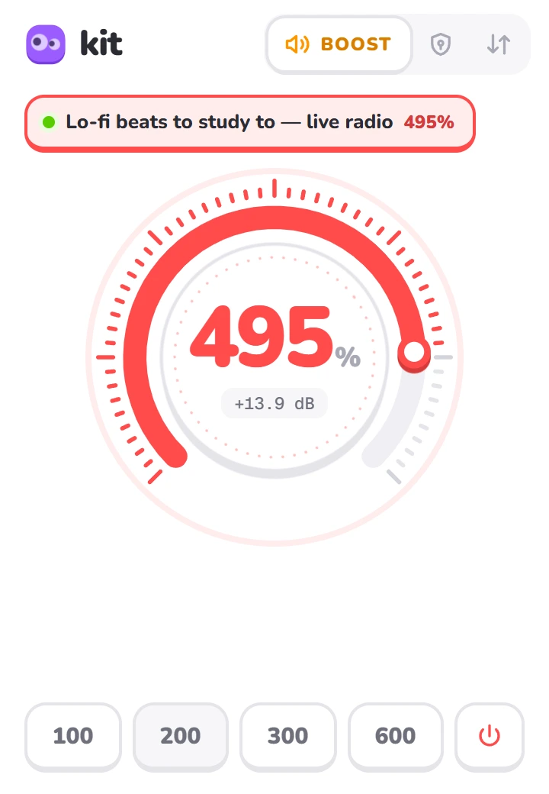
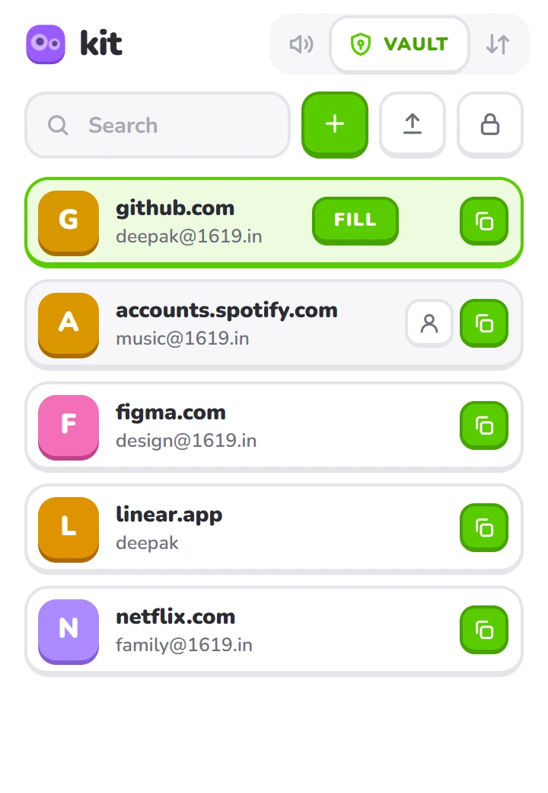
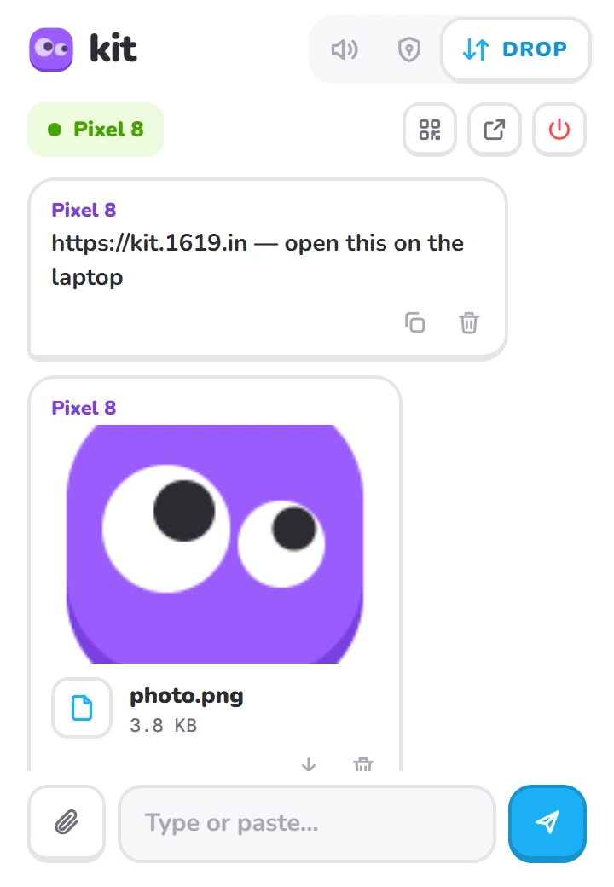
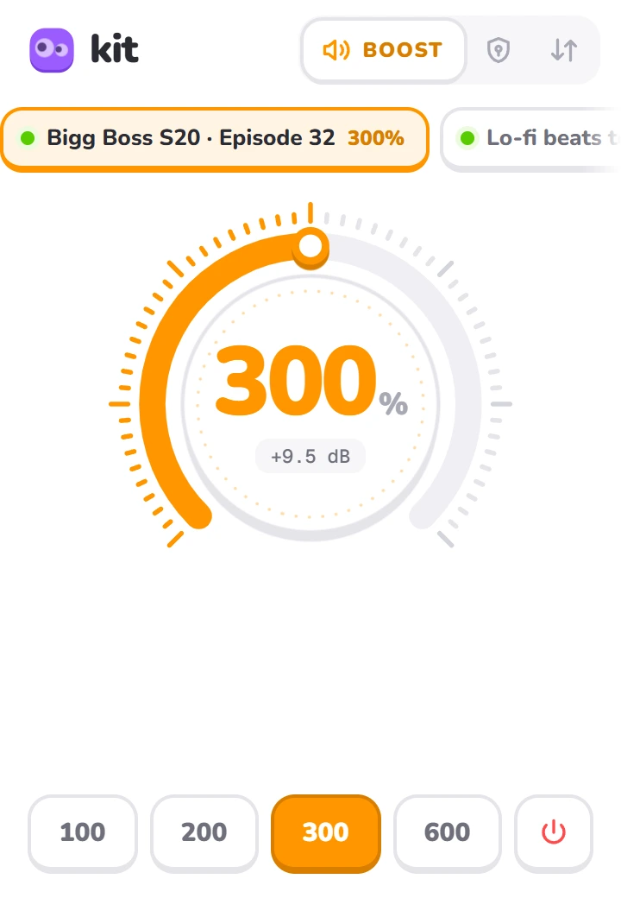
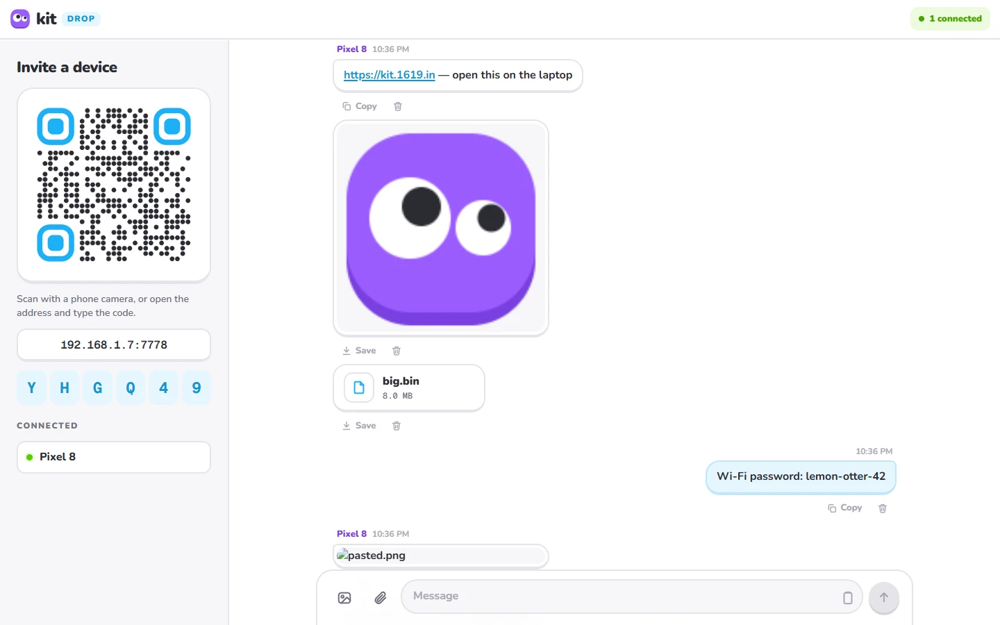
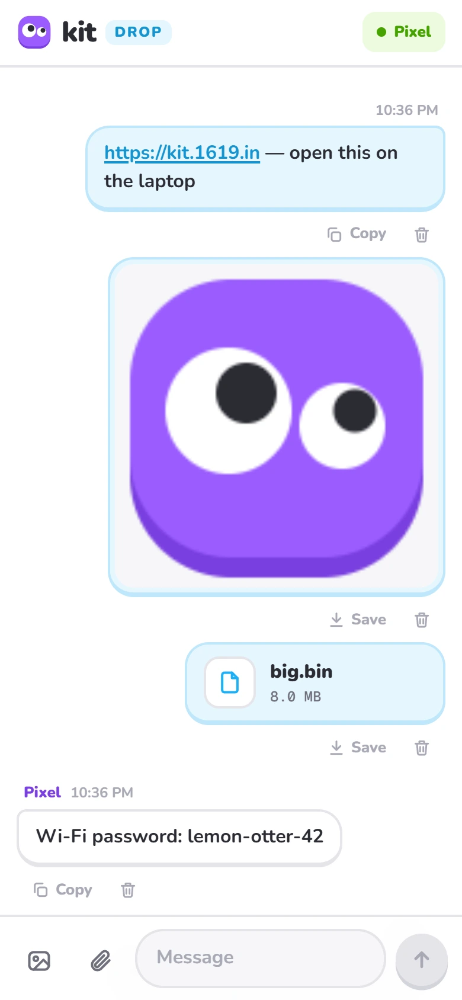

<p align="center">
  
</p>

<h1 align="center">Kit</h1>

<p align="center">
  Small, local-first tools for Chrome — <b>Boost</b>, <b>Vault</b>, <b>Drop</b>, and more to come.<br>
  No account. No cloud. No tracking.
</p>

<p align="center">
  <a href="https://github.com/KumarDeepak16/kit/releases/latest"></a>
  <a href="LICENSE"></a>
  
  
</p>

<p align="center">
  <a href="https://github.com/KumarDeepak16/kit/releases/latest/download/kit.zip"><b>⬇ Download kit.zip</b></a> ·
  <a href="https://kit.1619.in"><b>🌐 kit.1619.in</b></a> ·
  <a href="docs/">Docs</a> ·
  <a href="PRIVACY.md">Privacy</a>
</p>

<p align="center">
  
  &nbsp;
  
  &nbsp;
  
</p>

---

## What's inside

| Tool | What it does |
| --- | --- |
| **🔊 Boost** | Turn any tab up to **600%** (or down), kept clean by a limiter. Control several tabs from one dial. No "sharing this tab" icon. |
| **🛡 Vault** | Passwords **encrypted on your computer** (AES-256-GCM, PBKDF2 600k). One-click **Fill** on the site you're on. **Import** a CSV from Chrome, Edge, Firefox, Bitwarden, 1Password or LastPass. |
| **⇅ Drop** | Your computer becomes a tiny server on your **Wi-Fi**. Phones and laptops open it in a browser — no app — to swap **text, links, photos and files** both ways. |

## Requirements

| | Needed for | Details |
| --- | --- | --- |
| **Chromium browser 116+** | Everything | Chrome, Edge, Brave, Arc, Vivaldi, Opera… on Windows, macOS or Linux |
| **or Firefox 128+** | Everything | Boost can't use tab capture there, so DRM players (Netflix, Spotify…) can't be boosted |
| **Developer mode** | Installing | Kit isn't on the Chrome Web Store yet, so it's loaded unpacked |
| **[Node.js 18+](https://nodejs.org)** | Drop only | Runs the small local server. Boost and Vault don't need it. |
| **Same Wi-Fi** | Drop only | Your phone and computer on one network (guest networks often isolate devices) |
| **Any modern mobile browser** | Drop on phones | Chrome, Safari, Firefox, Samsung Internet — nothing to install |

## Install

1. Download **[kit.zip](https://github.com/KumarDeepak16/kit/releases/latest/download/kit.zip)** and unzip it somewhere permanent (Chrome loads it from that folder).
2. Open `chrome://extensions` and turn on **Developer mode** (top right).
3. Click **Load unpacked** and pick the **`kit/extension`** folder.
4. Pin Kit from the puzzle-piece menu. The buddy is **purple and awake** while something is running, **grey and asleep** when idle.

**Firefox:** open **[kit-firefox.xpi](https://github.com/KumarDeepak16/kit/releases/latest/download/kit-firefox.xpi)** in Firefox and click **Add**. For Drop, also download kit.zip for the helper below.

**For Drop (one time):** open `kit/helper` and double-click **`install.cmd`** (Windows) or run `sh install.sh` (macOS / Linux). Say yes to the firewall question so your phone can reach this computer.

**Updating:** download the new zip, replace the folder, press ↻ on Kit's card in `chrome://extensions`, and turn Drop off and on if it was running. Your vault is kept — the extension ID is fixed.

## Using it

### 🔊 Boost
Open Kit on a tab and drag the dial, scroll, use the arrow keys, or tap **100 · 200 · 300 · 600**. Every boosted tab shows up as a chip at the top — tap one to control it without switching tabs. Protected (DRM) players get an opt-in tab-capture mode. → [docs/BOOST.md](docs/BOOST.md)

<p align="center"></p>

### 🛡 Vault
Set a master password once (**it can't be recovered**). Add logins, generate strong passwords, click **Fill** on the site you're on, or **import** a CSV — there's a [sample file](extension/src/pages/sample-import.csv) and the [column format](docs/VAULT.md#csv-format). Locks itself after 15 minutes, on screen lock and when Chrome closes. → [docs/VAULT.md](docs/VAULT.md)

### ⇅ Drop
**Drop → Turn on**, scan the QR with your phone, name the device, send anything. Tap a photo to view or copy it. **⤢** opens the full-screen view on your computer. Turning Drop off deletes everything that was shared. → [docs/DROP.md](docs/DROP.md)

<p align="center">
  
  &nbsp;
  
</p>

Keyboard shortcuts, limits and troubleshooting are in **[docs/](docs/)**.

## Privacy

Kit has no servers and sends nothing anywhere. The vault is encrypted before it touches disk, and the key lives only in memory while unlocked. Boost processes audio live inside your browser. Drop runs only on your local network and deletes every shared file when you turn it off. Full details: **[PRIVACY.md](PRIVACY.md)** · security reports: **[SECURITY.md](SECURITY.md)**.

## Repository

```
extension/   the Chrome extension (Manifest V3, plain ES modules, no build step)
helper/      Drop's local server: a Node.js native-messaging host + the web app devices open
docs/        user guides, architecture notes and screenshots
.github/     release workflow — tagging vX.Y.Z publishes kit.zip
```

Want to add a tool or fix something? Start with **[CONTRIBUTING.md](CONTRIBUTING.md)** and **[docs/ARCHITECTURE.md](docs/ARCHITECTURE.md)**. Changes are listed in **[CHANGELOG.md](CHANGELOG.md)**.

## License

[MIT](LICENSE) © Deepak Kumar · [1619.in](https://1619.in) · Website [kit.1619.in](https://kit.1619.in) · GitHub [@KumarDeepak16](https://github.com/KumarDeepak16)
